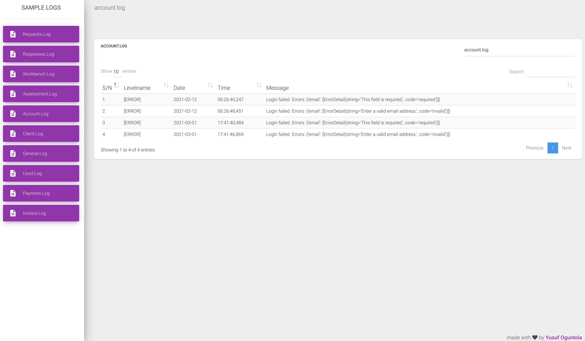

========================
Django simple log viewer
========================

Django simple log viewer is intended to be a simple app for viewing logs generated in a django project in a simple but intuitive way.

It uses default django `LOGGING` `setting <https://docs.djangoproject.com/en/3.2/topics/logging/>`_ to configure and load logs. If you have your settings 
as recommended by django, then you shouldn't have to do anything else.

Log columns are configured using the format setting for each log file, this app simply split up the format setting and use that to create column headers for the view page,
if you'd like to see things differently, then you need to update that setting (but make sure it conforms with what you have in the log files).

**It's recommended that you put the ``message`` attribute last in your format setting.**

Adding it to your project
=========================

1. Install with pip:: ``pip install django-simple-log-viewer``

2. Add ``log_viewer`` to ``INSTALLED_APPS`` in ``settings.py``

3. Add Log viewer to your URL conf:: ``path('log-viewer', include('log_viewer.urls')),`` OR ``url('log-viewer', include('log_viewer.urls'))`` as the case may be

4. Visit the log viewer URL to view your logs

SETTINGS
========
1. To change the name displayed on top of the navigation bar, add ``SITE_NAME`` to your ``settings.py`` and give it a string name

2. If you use a different extension (from .log) for your log files, add the setting ``LOG_FILE_EXTENSION`` to ``settings.py`` showing your extension. Default value is ``.log``
NB: Make sure to add a ``.`` before the extension name

3. To change the theme of the view page, extend ``log_viewer/log_home.html`` and set the theme name in the block theme. e.g:
`` green ``. (Options: purple | azure | green | orange | danger)

